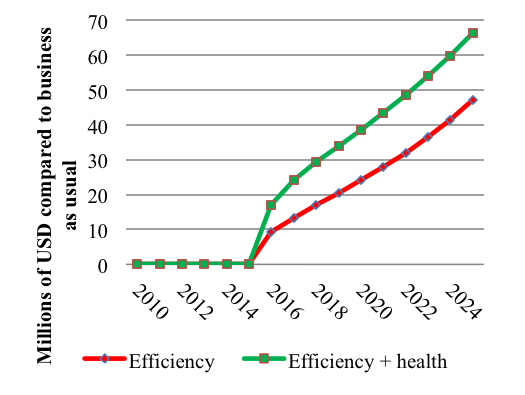

## Natural Capital Contributions to Wealth

From the perspective of comprehensive wealth, each country could think of its assets as more than just produced capital or financial capital. Wealth would be the sum of a portfolio of produced capital; natural capital; and human, social, and institutional capital, which together are responsible the flow of resource rents today and in the future.

A comprehensive evaluation of these different components of wealth[^1] in the World regions showed that in low-income countries, natural capital constitutes a larger share of total wealth than produced capital (35% vs. 15%). But more interesting is that in all countries intangible capital (human, social, and institutional) is the largest component of total wealth (as high as 77% globally). As countries move up the ladder, the share of natural capital shrinks. 

Richer nations rely more on their people's skills and their institutional environments to generate income, with natural capital representing as little as 3%. This hints that a successful transition into a higher income nation manages to capture a large share of natural resource rents and reinvest them in intangible capital to ensure sustainability of future income, once natural resources are depleted.

In the case of Latin America and the Caribbean, natural capital is on par with produced capital (15% of total wealth) and intangible capital represents 71% of the total. It is in the interest of the region to monitor closely how the rent of its natural resources is captured and reinvested in other forms of capital as these are consumed or excluded from productive processes. Yet traditional economic performance indicators such as GDP do not fully consider these other forms of capital or the sustainability of economic growth yearly flows.

## What is not measured is not managed

In order to overcome the limitations of traditional economic measures, standards like the System of Environmental and Economic Accounts (SEEA)[^2] move towards the inclusion of physical measures as extensions to the System of National Accounts, with which economic performance is normally assessed. Although natural capital accounting has existed in one form or another for decades, this particular standard is important because it has the same status as the System of National Accounts in the statistical hierarchy of the UN Statistical Commission. This constitutes an internationally‐agreed method to account for resources like minerals, timber and fisheries.

Currently more than 30 countries have implemented the System of Environmental and Economic Accounts (SEEA) around the world. In Latin America and the Caribbean there have been efforts in Mexico, Colombia, Costa Rica, Guatemala, Perú, Ecuador, Dominican Republic, with prospective implementations occurring in other countries as well. This means that there is a wealth of information, consistent with traditional economic frameworks that is becoming available to policy makers, researchers, and the general public. In order to improve how countries manage their resources, this information has to be taken into account in economic *ex-ante* and *ex-post* evaluations, as well as in policy design. 

## From description to comprehensive assessments

The Integrated Environmental and Economic Modeling (IEEM)[^3] framework is the first Computable General Equilibrium modeling framework designed with the specific aim of taking advantage of the System of Environmental and Economic Accounts (SEEA). It enables the analysis of policy impacts on the economy and the environment in a quantitative, comprehensive, and consistent framework. Integration of SEEA into a Computable General Equilibrium model  enhances our analytical power, overcoming the need for strong assumptions in reconciling economic–environmental data, increasing the timeliness of evidence-based policy advice.

The IEEM team chose the System of Environmental and Economic Accounts of Guatemala to test the framework[^4] in order to explore the relevant issue of fuelwood and, more generally, the use of forests in that country. IEEM was applied to evaluate the impacts of a proposed fuelwood strategy by simulating a 25% increase in the efficiency of household fuelwood use (efficiency scenario), which could be achieved through the use of more efficient fuelwood cookstoves such as the Patsari Cookstove. In a second scenario, the potential health benefits of improved fuelwood use efficiency was examined.

## Interesting results

The figure below illustrates some of the economic-environmental dimensions captured by IEEM, which would have previously required various models to estimate. The fuelwood efficiency scenario would result in a small decline in agricultural land use with a concomitant increase in forestland use as the pace of deforestation would slow with implementation of the fuelwood strategy. Forestry output would decline, as fuelwood prices fall, whereas water use would remain similar to baseline consumption levels despite the small decline in agricultural output. Total greenhouse gas emissions would fall as a result of the improvements in efficiency.

**_Figure 1. Multidimensional impacts: efficiency scenario_**

While GDP measures the component of well-being attributed to the production of goods and services, IEEM for the first time enables ex-ante estimation of indicators that capture the additional dimensions that contribute to well-being and national wealth. One such indicator is adjusted net savings which measures a country’s sustainability, indicating the extent that changes in natural and human capital are balanced by changes in physical capital. In essence, adjusted net savings it provides an indication of the current generation’s bequest to future generations. 

Figure 2 shows a variation of adjusted net savings which is national net savings, less the economic loss/cost of deforestation, reductions in mining assets, and greenhouse gas emissions as a result of both efficiency and efficiency + health scenarios. The greatest increase in savings would occur in the efficiency + health scenario with an increase of over US$66 million in 2040 and a cumulative savings increase of US$415 million, driven by the reduction in deforestation and emissions. With natural capital serving as the basis for future economic growth, the fuelwood strategy is unambiguously wealth-enhancing. 

**_Figure 2. Adjusted Net Savings_**

IEEM represents critical relationships between the environment and the economy and when used for public policy and investment analysis, produces results that could not previously be obtained through a single modeling framework. IEEM generates indicators that capture the multi-dimensionality of wealth and well-being as well as standard indicators that reveal impacts on GDP, income and employment.

## References

[^1]: Lange et al. (2011). ["The Changing Wealth of Nations"](http://documents.worldbank.org/curated/en/630181468339656734/The-changing-wealth-of-nations-measuring-sustainable-development-in-the-new-millennium). The World Bank.

[^2]: United Nations et al. (2012). ["System of Environmental and Economic Accounts. Central Framework"](http://unstats.un.org/unsd/envaccounting/seearev/). United Nations, European Commission, Food and Agriculture Organization of the United Nations, International Monetary Fund, Organization fro Economic Cooperation and Development, The World Bank.

[^3]: Banerjee et al. (2016a). ["A Conceptual Framework for Integrated Economic–Environmental Modeling"](http://jed.sagepub.com/content/25/3/276).

[^4]: Banerjee et al. (2016b). ["The SEEA-Based Integrated Economic-Environmental Modelling Framework: An Illustration with Guatemala’s Forest and Fuelwood Sector"](https://www.gtap.agecon.purdue.edu/resources/res_display.asp?RecordID=5075).